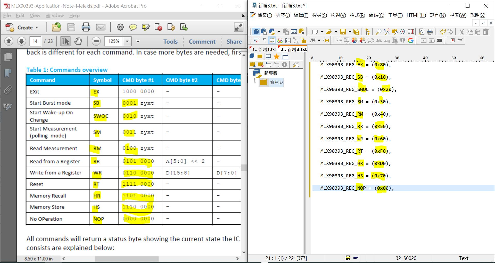

# MLX90393_testing
magnometer, read on-chip temperature, X,Y,Z
no need any library, testing only  

### To read and to understand the datasheet
it was not user friendly anyway, try your best,

MLX90393 memory type, RAM (volatile memory) and ROM (perhaps FLASH memory type, non-volatile memory).
```
both RAM and ROM are included two sections,  
CUSTOMER AREA (the first 32 addresses are programmable by the user)  
    0x00 - 0x09 (16bit word) Analog & Digital configuration bits, register 0~9, 16bit  
    0x0A - 0x1F (16bit word) free, user can store any information  
Melexis AREA (write protected)   
    0x20 - 0x3F (16bit word) read only   
```

HS command, copies the entire RAM to ROM  
HR command, copies the entire ROM to RAM, it is performed automatically either through power on reset or warm reset by RT command.  

WR command, write section of CUSTOMER AREA of RAM only  
RR command, read RAM, including CUSTOMER AREA and Melexis AREA  

The Customer area splited 3 types of 16bit registes:  
0x00 - 0x09, Analog & Digital configuration bits, 16bit REGISTER x 9  
0x0A - 0x1F, free, user can store any information  


example code, how to set Register-0 via I2C bus  
1, I2C write address 0x0c  
2, issue WR command  
3, value for register-0 higher-nibble  
4, value for register-0 lower-nibble  
5, register-0 << 2  
6, end I2C transimisson  
7, read STATUS byte  
```
    // init mlx90393 register0
    Wire.beginTransmission(Addr);    // Start I2C Transmission
    Wire.write(0x60); // WR 0x60 Write Register command, register 0x00, register-0 is 16 bits
    Wire.write(0x00); // Set register-0x00 higher 8bit = 0x00, BIST disabled
    Wire.write(0x5C); // Set register-0x00 lower 8bit = 0x5C, Z-SERIES 0b0, GAIN_SEL = 0b101, HALLCONF = 0b1100
    //Wire.write(0x00<<2);  //register0x00 to be writen, shift left by 2 bits, (0x00 << 2 = 0x00, see WR commend of datasheet)
    Wire.write(0x00);  //register0x00 to be writen, shift left by 2 bits, (0x00 << 2 = 0x00, see WR commend of datasheet)    
    Wire.endTransmission();    // Stop I2C Transmission
     
    Wire.requestFrom(Addr, 1);    // Request 1 byte of data
    if(Wire.available() == 1)    // Read status byte
    {
      unsigned int c = Wire.read();
    }
```


### commands
  

```
   MLX90393_REG_NOP = (0x00),   
   MLX90393_REG_SB = (0x10),  
   MLX90393_REG_SWOC = (0x20),  
   MLX90393_REG_SM = (0x30),  
   MLX90393_REG_RM = (0x40),  
   MLX90393_REG_RR = (0x50),  
   MLX90393_REG_WR = (0x60),  
   MLX90393_REG_HS = (0x70),
   MLX90393_REG_EX = (0x80),
// 0x90, 沒用或不公開
// 0xA0, 沒用或不公開
// 0xB0, 沒用或不公開
// 0xC0, 沒用或不公開     
   MLX90393_REG_HR = (0xD0),  
// 0xE0, 沒用或不公開 
   MLX90393_REG_RT = (0xF0),  
```

### dump the ROM / RAM (REGISTER 0x00 - 0x3F)
complete source code of the project - [MLX90393_dump_memory](MLX90393_dump_memory)   
result,  
```
MLX90393 16-bit Registers (RAM/ROM) Dump

By xiao_laba_cn@yahoo.com
==========================================

SoftReset

Load ROM to RAM

dump RAM, 0x00-0x1F user RAM read/write, 0x20-0x3F read only

MLX90393 16-bit Registers (RAM/ROM) Dump to C-array
// RAM 0x00 - 0x1F, CUSTOMER AREA, READ/WRITE section
// RAM 0x20 - 0x3F, MELEXIS AREA, READ only section
//             offset  =  0       1       2       3       4       5       6       7       8       9       A       B       C       D       E       F
----------------------------------------------------------------------------------------------------------------------------------------------------------
uint16_t REG_0x00 [16] = {0x805C, 0xE180, 0x01E5, 0x5543, 0x0000, 0x0000, 0x0000, 0x0000, 0x0000, 0x0000, 0x5A5A, 0x07EA, 0x07D0, 0x8080, 0x8078, 0x807D};
uint16_t REG_0x10 [16] = {0x807A, 0x0000, 0x0000, 0x0000, 0x0000, 0x0000, 0x0000, 0x0000, 0x0000, 0x0000, 0x0000, 0x0000, 0x0000, 0x0000, 0x0000, 0x0000};
uint16_t REG_0x20 [16] = {0x3098, 0x0E1B, 0x0205, 0x1156, 0xB665, 0x2945, 0x6AE6, 0x0328, 0x0102, 0x9C03, 0xA1AF, 0x4EBB, 0x0421, 0x0382, 0x0AA8, 0x2D34};
uint16_t REG_0x30 [16] = {0x50F7, 0x0000, 0x0000, 0x0000, 0x0000, 0x0000, 0x0000, 0x0000, 0x0000, 0x0000, 0x0000, 0x0000, 0x0000, 0x0000, 0x2148, 0xFB10};

Clean RAM 0x00 - 0x1F, fill in 0xABCD

dump RAM again, 0x00-0x1F user RAM read/write, 0x20-0x3F read only

MLX90393 16-bit Registers (RAM/ROM) Dump to C-array
// RAM 0x00 - 0x1F, CUSTOMER AREA, READ/WRITE section
// RAM 0x20 - 0x3F, MELEXIS AREA, READ only section
//             offset  =  0       1       2       3       4       5       6       7       8       9       A       B       C       D       E       F
----------------------------------------------------------------------------------------------------------------------------------------------------------
uint16_t REG_0x00 [16] = {0xABCD, 0xABCD, 0xABCD, 0xABCD, 0xABCD, 0xABCD, 0xABCD, 0xABCD, 0xABCD, 0xABCD, 0xABCD, 0xABCD, 0xABCD, 0xABCD, 0xABCD, 0xABCD};
uint16_t REG_0x10 [16] = {0xABCD, 0xABCD, 0xABCD, 0xABCD, 0xABCD, 0xABCD, 0xABCD, 0xABCD, 0xABCD, 0xABCD, 0xABCD, 0xABCD, 0xABCD, 0xABCD, 0xABCD, 0xABCD};
uint16_t REG_0x20 [16] = {0x3098, 0x0E1B, 0x0205, 0x1156, 0xB665, 0x2945, 0x6AE6, 0x0328, 0x0102, 0x9C03, 0xA1AF, 0x4EBB, 0x0421, 0x0382, 0x0AA8, 0x2D34};
uint16_t REG_0x30 [16] = {0x50F7, 0x0000, 0x0000, 0x0000, 0x0000, 0x0000, 0x0000, 0x0000, 0x0000, 0x0000, 0x0000, 0x0000, 0x0000, 0x0000, 0x2148, 0xFB10};

```


### burn.bat
burn firmware to MCU

### wire connection  
MLX90393 pin  --- MCU pin or Arduino pin   
VCC           --- +3v3  
GND           --- GND  
SDA           --- SDA or A4  
SCL or SCK    --- SCL or A5  
   

### source code
[MLX90393.ino](MLX90393.ino)  

### firmware
with bootloader for Arduino UNO/NANO  
[MLX90393.ino.with_bootloader.standard.hex  ](MLX90393.ino.with_bootloader.standard.hex)    

for Atmega328p/168/8, no bootloader used  
[MLX90393.ino.standard.hex](MLX90393.ino.standard.hex)    


### result
   

